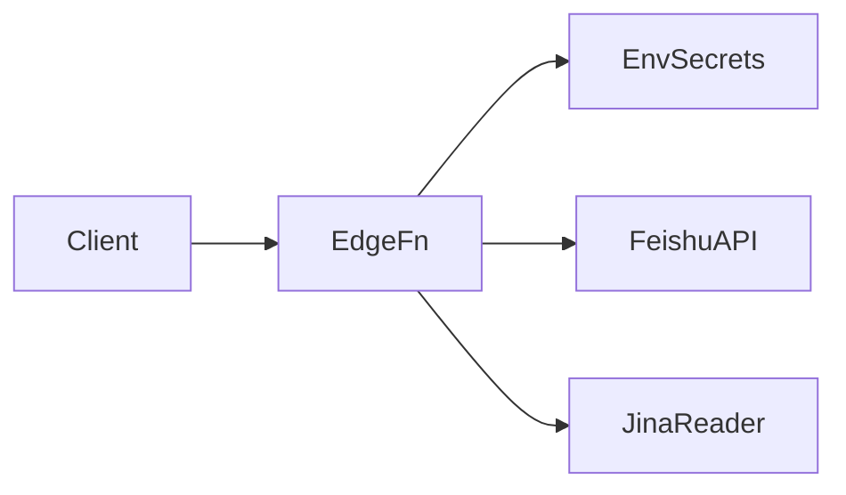

# 1. 问题

当前 Supabase Edge Function `supabase/functions/fetch-feishu-doc/index.ts` 在源码中直接硬编码了飞书的 `APP_ID` 与 `APP_SECRET`。这会带来明显的安全与运维风险：凭据泄露概率高、密钥轮换需要改代码并重新发布、不同环境无法隔离配置，且不利于合规与审计。

## 1.1. **硬编码密钥与凭据管理缺失**
- 位置：`supabase/functions/fetch-feishu-doc/index.ts` 第 9-12 行。
```ts
// Config from feishuConfig.ts
const APP_ID = 'cli_a9c0f8b111f91bc7';
const APP_SECRET = 'XaMgD0puOz7jwWgtT7krkejeWQKHEBts';
```
- 问题分析：
  - 凭据直接存在于代码仓库，任何对仓库或构建产物的访问都可能获取到密钥。
  - 一旦泄露，需要紧急轮换并重新发布函数，过程慢且受发版窗口约束。
  - 难以按环境（开发/测试/生产）配置独立密钥，增加误用与跨环境污染风险。

## 1.2. **环境隔离与密钥轮换困难**
- 目前的实现意味着：
  - 轮换需要修改代码与重新部署，无法做到“配置级”快速替换。
  - CI/CD 无法在不同环境注入不同密钥，审计与合规（例如最小权限、凭据不入库）难以满足。
- 额外影响：开发者容易在日志、故障排查中无意间暴露密钥（例如拷贝代码片段），合规风险上升。

# 2. 收益

将密钥从源码迁移到运行时环境变量（通过 Supabase Secrets 管理）可在不改变对外行为的前提下提升安全性与可维护性。

## 2.1. **安全性显著提升**
- 凭据不再出现在仓库与构建产物中，泄露面显著收缩。
- 结合最小权限与按环境分配，降低误用风险。

## 2.2. **支持多环境隔离与合规**
- 不同环境分别配置独立密钥，符合“配置不入库”的合规要求。
- 便于在审计中追踪密钥管理操作（通过 CLI 与平台记录）。

## 2.3. **运维效率提升**
- 密钥轮换从一次发版（通常 **1-2 小时**）降为通过 Secrets 刷新并重启函数（约 **1-5 分钟**）。
- 无需代码改动，减少开发占用与回归成本。

## 2.4. **更好的错误提示与可观测性**
- 明确的环境变量缺失校验与错误信息，利于定位问题且避免泄露敏感内容。

# 3. 方案

总体思路：将硬编码的飞书凭据迁移到 Supabase Edge Function 的运行时环境变量，通过 Supabase Secrets 进行管理；在读取处加入严格校验与清晰错误信息，保持接口与行为一致。

## 3.1. **使用运行时环境变量管理密钥：解决“硬编码密钥与凭据管理缺失”**

- 方案概述：
  - 通过 `Deno.env.get` 读取 `FEISHU_APP_ID` 与 `FEISHU_APP_SECRET`。
  - 通过 Supabase 的 Secrets 在不同环境分别注入密钥。
  - 在函数启动或首次请求时校验环境变量是否存在，缺失则返回明确错误。

- 实施步骤：
  1. 在 Supabase 项目中设置 Secrets（生产环境示例）：
     - `supabase secrets set FEISHU_APP_ID=your_app_id`
     - `supabase secrets set FEISHU_APP_SECRET=your_app_secret`
  2. 为测试/开发环境分别设置各自的 Secrets，确保环境隔离。
  3. 修改 `index.ts`：改为从环境变量读取并校验。
  4. 部署与验证：发布函数后，验证正常获取 Token 与文档内容；缺失或错误凭据时返回清晰错误。

- 修改前代码（节选）：
```ts
const APP_ID = 'cli_a9c0f8b111f91bc7';
const APP_SECRET = 'XaMgD0puOz7jwWgtT7krkejeWQKHEBts';

const tokenRes = await fetch("https://open.feishu.cn/open-apis/auth/v3/tenant_access_token/internal", {
  method: "POST",
  headers: { "Content-Type": "application/json" },
  body: JSON.stringify({ app_id: APP_ID, app_secret: APP_SECRET }),
});
```

- 修改后代码（建议实现）：
```ts
// 通过环境变量读取，不在仓库中存储敏感信息
const APP_ID = Deno.env.get('FEISHU_APP_ID');
const APP_SECRET = Deno.env.get('FEISHU_APP_SECRET');

if (!APP_ID || !APP_SECRET) {
  console.error('Missing FEISHU_APP_ID or FEISHU_APP_SECRET');
  return new Response(JSON.stringify({
    error: 'Server misconfigured: FEISHU_APP_ID or FEISHU_APP_SECRET is missing'
  }), {
    status: 500,
    headers: { ...corsHeaders, 'Content-Type': 'application/json' }
  });
}

const tokenRes = await fetch(
  'https://open.feishu.cn/open-apis/auth/v3/tenant_access_token/internal',
  {
    method: 'POST',
    headers: { 'Content-Type': 'application/json' },
    body: JSON.stringify({ app_id: APP_ID, app_secret: APP_SECRET }),
  }
);
```

- 调用关系示意（目标状态）：

说明：客户端调用 Edge Function，函数从环境中读取密钥访问飞书 API。若 API 不可用或无 Token，回退到 Jina Reader。环境密钥与代码解耦，支持快速轮换与环境隔离。

## 3.2. **补充部署规范与校验：支持“环境隔离与密钥轮换困难”的治理**

- 方案概述：
  - 在部署流程中明确：各环境分别注入 Secrets，不将任何凭据写入仓库与构建产物。
  - 增加启动校验与错误信息，便于快速定位配置问题，避免将错误掩盖为业务问题。

- 实施步骤：
  - CI/CD：在不同环境阶段使用各自的 `FEISHU_APP_ID`、`FEISHU_APP_SECRET` 注入。
  - 本地开发：通过 CLI 设置或使用本地环境变量，同名注入后再执行 `supabase functions serve`。
  - 观测：在日志中仅记录“缺失/不可用”的状态，不输出具体密钥内容；必要时记录飞书 API 返回的错误码以便排查。

# 4. 回归范围

从业务流程角度验证“读取文档内容”的端到端链路在密钥迁移后仍保持一致，对异常场景给出明确错误提示与安全行为。

## 4.1. 主链路
- 场景 A：提供 `docx` 链接，函数读取环境密钥，获取租户 Token 与文档内容，返回 Markdown 文本。
- 场景 B：提供 `wiki` 链接，解析节点获取真实 `docx` Token，读取内容返回。
- 场景 C：飞书 API 不可用或权限不足时，回退到 Jina Reader，仍返回可分析的文本。

可参考用例要点：
- 预置：环境变量 `FEISHU_APP_ID`、`FEISHU_APP_SECRET` 已正确配置；链接可公开访问。
- 操作：分别提交 `docx` 与 `wiki` 链接，观察返回是否包含内容且无报错。
- 期望：返回非空 Markdown 文本；日志不包含密钥值。

## 4.2. 边界情况
- 环境变量缺失：返回 500 与“Server misconfigured”提示；日志仅记录缺失状态，不输出密钥。
- 密钥错误或已失效：飞书鉴权失败；若无法获取内容则触发回退；错误信息包含飞书返回码（不含密钥）。
- 飞书 API 限速或网络异常：请求失败后走回退路径；验证最终用户仍可获得可读内容。
- 高并发下的稳定性：多次并发请求下，确保不出现读取环境变量的竞态问题（只读访问），日志量可控。

通过以上方案与验证，既消除了硬编码带来的安全与合规风险，又保持了原有功能和用户体验的一致性。